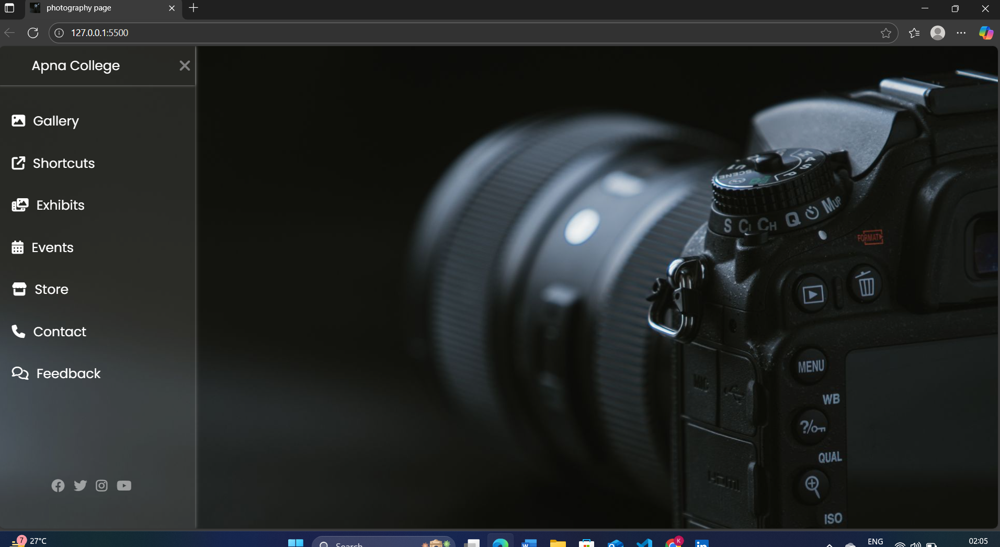

# 📸 Photography Portfolio Website

A clean and minimal **Photography Portfolio** website built using **HTML** and **CSS**.  
It features a **sidebar navigation menu**, smooth animations, and social media links — perfect for showcasing photography work.

---

## 🚀 Features
- **Responsive** sidebar navigation
- Toggle menu with Font Awesome icons
- Integrated **Google Fonts (Poppins)**
- Social media icon links

---

## 📂 Project Structure
photography-portfolio/
│── index.html # Main HTML file
│── style.css # CSS file
│── images/
│ ├── camera.jpeg
│ └── preview.png
│── README.md 


---

## 🛠️ Technologies Used
- **HTML5**
- **CSS3**
- [Google Fonts - Poppins](https://fonts.google.com/specimen/Poppins)
- [Font Awesome Icons](https://fontawesome.com/)

---

## 📷 Screenshot
### Homepage Preview


---

## 📦 Installation & Usage
1. **Clone the repository**
   ```bash
   git clone https://github.com/khushi-gupta-dev/photography-portfolio.git

2. **open the project**
- Navigate to the folder
- open index.html in your browser